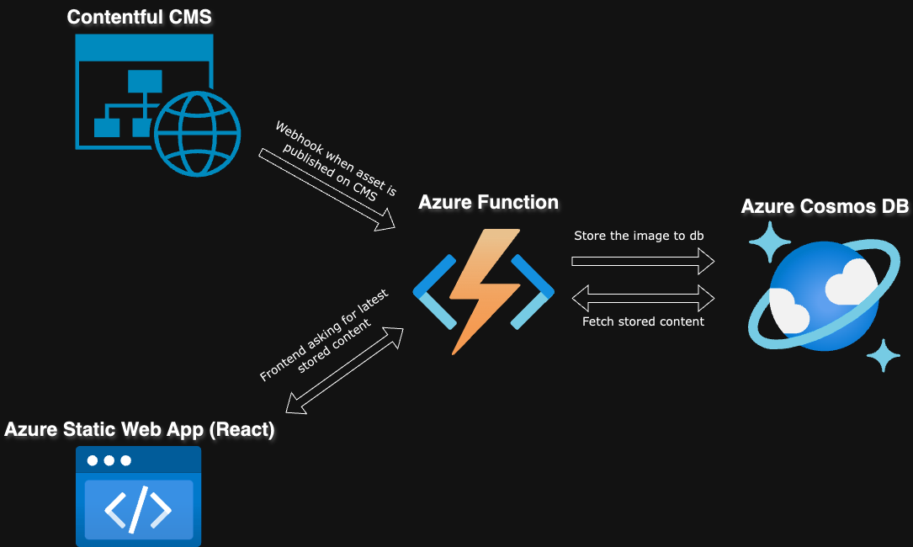

# AzureApp

## Overview

AzureApp is a learning project created to explore and familiarize myself with various Azure services including Azure Static Web Apps, Azure Functions, Azure Cosmos DB, and Cloud in general. The project also incorporates GitHub Actions for Continuous Integration (CI) and Continuous Deployment (CD), giving me hands-on experience with automating the deployment process. Additionally, I worked on managing APIs and integrating an external Contentful CMS for dynamic content management. As of now, the website displays a simple image.  Now that the foundation is in place, further development and functionality could easily be added. 

## Purpose

The primary purpose of AzureApp is to serve as a hands-on exploration into:

	•	Hosting a website using Azure Static Web Apps.
	•	Implementing serverless backend functionality using Azure Functions.
	•	Utilizing Azure Cosmos DB as a scalable NoSQL database.
	•	Managing and automating the deployment process with GitHub Actions for CI/CD.
	•	Working with and managing APIs to facilitate communication between various services.
	•	Integrating Contentful CMS to easily manage and update content without code modifications.

## Key Features

	•	Static Web App: The website is hosted using Azure’s Static Web App service, offering fast, scalable, and secure web hosting.
	•	Azure Functions: Serverless functions are implemented to handle backend logic, such as API integrations and dynamic content fetching.
	•	Azure Cosmos DB: A highly scalable NoSQL database is used for efficient data storage and retrieval.
	•	Contentful CMS: The Contentful CMS is integrated to manage the website’s content, enabling updates without the need for direct code changes.
	•	GitHub Actions for CI/CD: GitHub Actions automates the continuous integration and deployment processes, ensuring that the latest code changes are automatically built and deployed to Azure.
	•	API Management: Developed and managed APIs to facilitate seamless communication between different services, such as Contentful, Azure Functions, and Cosmos DB.

## Learning Outcomes

Through this project, I gained significant experience in:

	•	Understanding and using core Azure services like Static Web Apps, Functions, and Cosmos DB.
	•	Automating the deployment process using GitHub Actions for CI/CD.
	•	Managing APIs and integrating various cloud-based services.
	•	Working with serverless architectures to create scalable and cost-effective applications.
	•	Using Contentful CMS to decouple content management from the development process.

